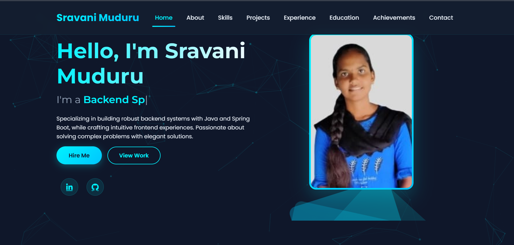

# My Personal Portfolio

This is my **personal portfolio website** built with React. It showcases my projects, skills, education, certifications, and provides a way to contact me.

---

## 🌐 Live Preview
Check out the live website here: [My Portfolio Live](https://sravani-portfolio-website.netlify.app/)

---

## 🚀 Features

- **Home Section** – Engaging landing page with introduction and key highlights.  
- **About Section** – Detailed introduction about me and my journey.  
- **Skills Section** – Showcase of my technical and professional skills.  
- **Education Section** – Academic background and achievements.  
- **Certification Section** – Professional courses and certifications.  
- **Projects Section** – Portfolio of my projects with descriptions and links.  
- **Contact Section** – Form to send messages directly via the website.  
- **Responsive Design** – Works seamlessly on desktop, tablet, and mobile.  
- **Smooth Navigation** – Easy scrolling and interactive UI.  

---

## 💻 Technology Stack

- **Frontend:** React.js, HTML5, CSS3, JavaScript (ES6+)  
- **Styling:** Tailwind CSS / CSS Modules / Styled Components *(replace as used)*  
- **Deployment:** GitHub Pages / Vercel / Netlify  
- **Other Tools:** Create React App, React Router, Axios  

---

## 🖼 Screenshots

### Home


### About


### Skills


### Education


### Certification


### Contact


### Projects


---

## ⚡ Getting Started

Follow these steps to run the project locally:

   1. **Clone the repository**

    ```bash
  git clone https://github.com/SravaniMuduru/Sravani-Portfolio-Website.git
  cd Sravani-Portfolio-Website

   2. Install dependencies
        npm install
   3. Run the app
        npm start
   4. Build for production
       npm run build

---
📫 Contact 
   **Email:** [sravanimuduru207@gmail.com](mailto:sravanimuduru207@gmail.com) 
   **LinkedIn:** [linkedin.com/in/sravani-muduru-596a712aa/](https://www.linkedin.com/in/sravani-muduru-596a712aa/) 
   **GitHub:** [github.com/Sravanimuduru](https://github.com/SravaniMuduru) 
